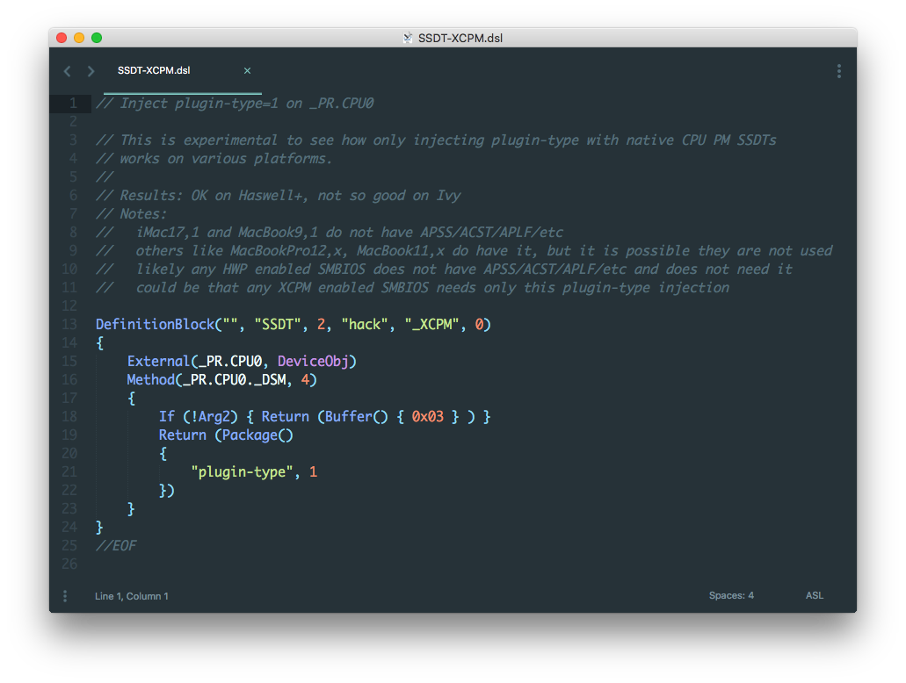

# ASL Syntax Highlight

**Note:** this syntax highlighting is distributed to Sublime build >= 3143.

The syntax highlighting is converted from the Atom editor [language-asl](https://github.com/sebadur/language-asl).

### Install

clone this repo into your Sublime `Packages` folder.

### License

[MIT](https://opensource.org/licenses/MIT)
